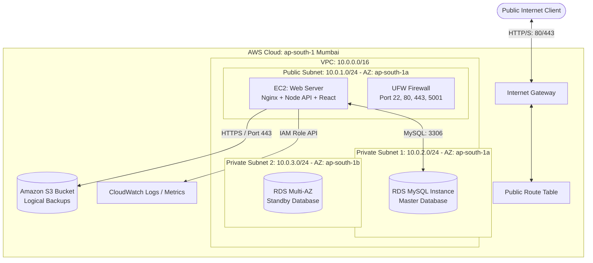

# AWS Cloud Infrastructure & Full-Stack Platform
## FanEngage Case Study & Viva Presentation Manual
> **Absolute Single Source of Truth for Zero-to-Hero Rebuilding & Presentation**

---

## Table of Contents
1. **Cloud Architecture & Networking Topology**
2. **AWS CloudFormation & CLI Provisioning**
3. **Linux Administration & Host Setup (Ubuntu 22.04)**
4. **DevOps Automation Scripts (S3 Backups & CloudWatch)**
5. **Docker Orchestration & Containerization**
6. **Disaster Recovery & Financial Strategy (TCO)**
7. **Live Demo Walkthrough & RBAC Accounts**
8. **Rigorous Viva Preparation & Q&A Cheatsheet**

---

# 1. Cloud Architecture & Networking Topology

To achieve high availability, fault tolerance, and security isolation, the FanEngage platform uses a decoupled tier-based networking layout inside a custom **Virtual Private Cloud (VPC)** on AWS.



### Subnet Layout
*   **Public Subnet (`10.0.1.0/24`)**: Houses the EC2 web server instance. An Internet Gateway is associated with the subnet's route table, mapping incoming traffic from the external world directly to the server.
*   **Private Subnets (`10.0.2.0/24` and `10.0.3.0/24`)**: Houses the database cluster. These subnets have no Route to the Internet Gateway, preventing direct access from the web.
    *   *Note*: AWS RDS requires a DB Subnet Group spanning at least **two** Availability Zones (AZs) to set up Multi-AZ deployments, which is why both Private Subnet 1 (`ap-south-1a`) and Private Subnet 2 (`ap-south-1b`) are defined.

### Security Group Policies (Stateful Firewalls)
AWS Security Groups operate as firewall filters at the network interface layer.
1.  **EC2 Security Group (`WebSecurityGroup`)**:
    *   **Inbound**: Port 22 (SSH from admin IP), Port 80 (HTTP from anywhere), Port 443 (HTTPS from anywhere), Port 5001 (Express API from anywhere).
    *   **Outbound**: All traffic (`0.0.0.0/0`) permitted (to update system packages, talk to S3, and push metrics to CloudWatch).
2.  **RDS Security Group (`DBSecurityGroup`)**:
    *   **Inbound**: Port 3306 (MySQL) **restricted exclusively** to source traffic from `WebSecurityGroup`.
    *   **Outbound**: Blocked by default.

---

# 2. AWS CloudFormation & CLI Provisioning

If building the infrastructure from scratch, execute the following steps using the AWS CLI and CloudFormation templates.

### Step 2.1: CLI Configuration
Before running any infrastructure scripts, authenticate your local terminal to AWS:
```bash
# Enter your AWS Access Key, Secret Key, default region (ap-south-1), and output formats
aws configure
```

Verify your active credentials:
```bash
aws sts get-caller-identity
```

### Step 2.2: CloudFormation Infrastructure Code
Save the following configuration as `cloudformation.yml`:
```yaml
AWSTemplateFormatVersion: '2010-09-09'
Description: 'FanEngage Sports Fan Platform AWS Infrastructure'

Parameters:
  DBUsername:
    Type: String
    Default: 'admin'
  DBPassword:
    Type: String
    NoEcho: true
    Default: 'fanengage_admin123'
  KeyName:
    Type: AWS::EC2::KeyPair::KeyName
    Description: Name of an existing EC2 KeyPair to enable SSH access

Resources:
  VPC:
    Type: AWS::EC2::VPC
    Properties:
      CidrBlock: '10.0.0.0/16'
      EnableDnsSupport: true
      EnableDnsHostnames: true
      Tags: [{ Key: Name, Value: FanEngage-VPC }]

  InternetGateway:
    Type: AWS::EC2::InternetGateway
    Properties:
      Tags: [{ Key: Name, Value: FanEngage-IGW }]

  VPCGatewayAttachment:
    Type: AWS::EC2::VPCGatewayAttachment
    Properties:
      VpcId: !Ref VPC
      InternetGatewayId: !Ref InternetGateway

  PublicSubnet:
    Type: AWS::EC2::Subnet
    Properties:
      VpcId: !Ref VPC
      CidrBlock: '10.0.1.0/24'
      MapPublicIpOnLaunch: true
      AvailabilityZone: !Select [0, !GetAZs '']
      Tags: [{ Key: Name, Value: FanEngage-Public-Subnet }]

  PrivateSubnet1:
    Type: AWS::EC2::Subnet
    Properties:
      VpcId: !Ref VPC
      CidrBlock: '10.0.2.0/24'
      AvailabilityZone: !Select [0, !GetAZs '']
      Tags: [{ Key: Name, Value: FanEngage-Private-Subnet-1 }]

  PrivateSubnet2:
    Type: AWS::EC2::Subnet
    Properties:
      VpcId: !Ref VPC
      CidrBlock: '10.0.3.0/24'
      AvailabilityZone: !Select [1, !GetAZs '']
      Tags: [{ Key: Name, Value: FanEngage-Private-Subnet-2 }]

  PublicRouteTable:
    Type: AWS::EC2::RouteTable
    Properties:
      VpcId: !Ref VPC
      Tags: [{ Key: Name, Value: FanEngage-Public-RT }]

  PublicRoute:
    Type: AWS::EC2::Route
    DependsOn: VPCGatewayAttachment
    Properties:
      RouteTableId: !Ref PublicRouteTable
      DestinationCidrBlock: '0.0.0.0/0'
      GatewayId: !Ref InternetGateway

  PublicSubnetRouteTableAssociation:
    Type: AWS::EC2::SubnetRouteTableAssociation
    Properties:
      SubnetId: !Ref PublicSubnet
      RouteTableId: !Ref PublicRouteTable

  WebSecurityGroup:
    Type: AWS::EC2::SecurityGroup
    Properties:
      GroupDescription: Allow SSH, HTTP, HTTPS, and API port
      VpcId: !Ref VPC
      SecurityGroupIngress:
        - IpProtocol: tcp
          FromPort: 22
          ToPort: 22
          CidrIp: '0.0.0.0/0'
        - IpProtocol: tcp
          FromPort: 80
          ToPort: 80
          CidrIp: '0.0.0.0/0'
        - IpProtocol: tcp
          FromPort: 443
          ToPort: 443
          CidrIp: '0.0.0.0/0'
        - IpProtocol: tcp
          FromPort: 5001
          ToPort: 5001
          CidrIp: '0.0.0.0/0'
      Tags: [{ Key: Name, Value: FanEngage-Web-SG }]

  DBSecurityGroup:
    Type: AWS::EC2::SecurityGroup
    Properties:
      GroupDescription: Allow MySQL access from Web SG
      VpcId: !Ref VPC
      SecurityGroupIngress:
        - IpProtocol: tcp
          FromPort: 3306
          ToPort: 3306
          SourceSecurityGroupId: !Ref WebSecurityGroup
      Tags: [{ Key: Name, Value: FanEngage-DB-SG }]

  DBSubnetGroup:
    Type: AWS::RDS::DBSubnetGroup
    Properties:
      DBSubnetGroupDescription: Private subnets for RDS
      SubnetIds: [!Ref PrivateSubnet1, !Ref PrivateSubnet2]

  MySQLDatabase:
    Type: AWS::RDS::DBInstance
    Properties:
      Engine: mysql
      EngineVersion: '8.0'
      DBInstanceClass: db.t3.micro
      AllocatedStorage: 20
      DBName: fanengage_db
      MasterUsername: !Ref DBUsername
      MasterUserPassword: !Ref DBPassword
      DBSubnetGroupName: !Ref DBSubnetGroup
      VPCSecurityGroups: [!Ref DBSecurityGroup]
      PubliclyAccessible: false
      Tags: [{ Key: Name, Value: FanEngage-DB }]

  WebServerInstance:
    Type: AWS::EC2::Instance
    Properties:
      ImageId: 'ami-0326c8c1e2d6bf78c' # Ubuntu 22.04 LTS ap-south-1
      InstanceType: 't3.micro'
      KeyName: !Ref KeyName
      SubnetId: !Ref PublicSubnet
      SecurityGroupIds: [!Ref WebSecurityGroup]
      Tags: [{ Key: Name, Value: FanEngage-Web-Server }]

Outputs:
  WebServerPublicIP:
    Description: Public IP of the EC2 Instance
    Value: !GetAtt WebServerInstance.PublicIp
  DatabaseEndpoint:
    Description: Connection endpoint for RDS MySQL
    Value: !GetAtt MySQLDatabase.Endpoint.Address
```

### Step 2.3: Shell Commands for Deployment
1.  **Generate a new EC2 Key Pair**:
    ```bash
    aws ec2 create-key-pair \
        --key-name fanengage-key \
        --region ap-south-1 \
        --query 'KeyMaterial' \
        --output text > fanengage-key.pem

    # Lock permissions to satisfy SSH client rules
    chmod 400 fanengage-key.pem
    ```

2.  **Deploy Stack via CloudFormation**:
    ```bash
    aws cloudformation deploy \
        --template-file cloudformation.yml \
        --stack-name FanEngage-App-Stack \
        --region ap-south-1 \
        --parameter-overrides KeyName="fanengage-key" \
        --capabilities CAPABILITY_IAM
    ```

3.  **Fetch Outputs**:
    ```bash
    # Extract EC2 Public IP
    aws cloudformation describe-stacks \
        --stack-name FanEngage-App-Stack \
        --region ap-south-1 \
        --query "Stacks[0].Outputs[?OutputKey=='WebServerPublicIP'].OutputValue" \
        --output text

    # Extract RDS Endpoint DNS Name
    aws cloudformation describe-stacks \
        --stack-name FanEngage-App-Stack \
        --region ap-south-1 \
        --query "Stacks[0].Outputs[?OutputKey=='DatabaseEndpoint'].OutputValue" \
        --output text
    ```

---

# 3. Linux Administration & Host Setup (Ubuntu 22.04)

After the EC2 instance is created, connect to it and run these commands to set up the runtime environment.

### Step 3.1: Establish SSH Connection
```bash
ssh -i fanengage-key.pem ubuntu@<YOUR_EC2_PUBLIC_IP>
```

### Step 3.2: Host Bootstrapping & Setup
Run the following commands on the server:

```bash
# Update local packages
sudo apt-get update -y && sudo apt-get upgrade -y

# Install Node.js 20 LTS from NodeSource
curl -fsSL https://deb.nodesource.com/setup_20.x | sudo -E bash -
sudo apt-get install -y nodejs

# Verify runtimes
node -v
npm -v

# Install Nginx reverse proxy
sudo apt-get install -y nginx
sudo systemctl enable nginx
sudo systemctl start nginx

# Install Docker Engine & Compose
sudo apt-get install -y docker.io docker-compose
sudo systemctl enable docker
sudo systemctl start docker

# Add ubuntu user to docker group to run docker without sudo
sudo usermod -aG docker ubuntu
newgrp docker # Reload group memberships

# Install MySQL Client CLI (required for running routine backups)
sudo apt-get install -y mysql-client

# Install AWS CLI (required to upload database backups to S3)
sudo apt-get install -y awscli

# Install PM2 globally
sudo npm install -g pm2
pm2 startup systemd -u ubuntu --hp /home/ubuntu
```

### Step 3.3: Configure Host Firewalls (UFW)
Configure rules on the host to allow necessary traffic:
```bash
sudo ufw default deny incoming
sudo ufw default allow outgoing

sudo ufw allow OpenSSH   # Port 22
sudo ufw allow 80/tcp    # HTTP Nginx
sudo ufw allow 443/tcp   # HTTPS Nginx
sudo ufw allow 5001/tcp  # Backend Node App

sudo ufw --force enable
sudo ufw status verbose
```

---

# 4. DevOps Automation Scripts

We use shell scripts and cron jobs to manage backups and system monitoring automatically.

### Script 4.1: Database Backup Engine (`backup-db.sh`)
This script executes a logical database dump (`mysqldump`), compresses it, uploads it to S3, and rotates local archives.

Save the script to `/home/ubuntu/scripts/backup-db.sh`:
```bash
#!/bin/bash
# backup-db.sh — Routine database backup script
set -e

DB_NAME="fanengage_db"
DB_USER="admin"
DB_PASSWORD="fanengage_admin123"
DB_HOST="<YOUR_RDS_ENDPOINT_HERE>"
S3_BUCKET="s3://fanengage-backups-bucket"
BACKUP_DIR="/home/ubuntu/backups"
DATE=$(date +%Y%m%d_%H%M%S)
FILENAME="fanengage_backup_${DATE}.sql.gz"

mkdir -p "$BACKUP_DIR"

echo "[$(date)] Starting logical database dump..."
mysqldump -h "$DB_HOST" -u "$DB_USER" -p"$DB_PASSWORD" "$DB_NAME" | gzip > "$BACKUP_DIR/$FILENAME"

echo "[$(date)] Uploading archive to S3 standard storage..."
aws s3 cp "$BACKUP_DIR/$FILENAME" "$S3_BUCKET/db-backups/$FILENAME"

# Keep only the last 7 local backup archives on the server
ls -t "$BACKUP_DIR"/*.sql.gz | tail -n +8 | xargs -r rm

echo "[$(date)] Routine backup completed successfully: $FILENAME"
```

### Script 4.2: Health Metric Daemon (`monitor.sh`)
This script collects CPU, Memory, and Disk utilization details, and writes them to custom metrics in Amazon CloudWatch.

Save the script to `/home/ubuntu/scripts/monitor.sh`:
```bash
#!/bin/bash
# monitor.sh — Gathers CPU, Memory, and Disk stats
set -e

# Fetch Instance ID from AWS IMDSv2 Metadata service
TOKEN=$(curl -s -X PUT "http://169.254.169.254/latest/api/token" -H "X-aws-ec2-metadata-token-ttl-seconds: 21600")
INSTANCE_ID=$(curl -s -H "X-aws-ec2-metadata-token: $TOKEN" http://169.254.169.254/latest/meta-data/instance-id)
REGION="ap-south-1"
NAMESPACE="FanEngage/System"

# Calculate System Usage Details
CPU=$(top -bn1 | grep "Cpu(s)" | awk '{print $2}' | cut -d'%' -f1)
MEM_TOTAL=$(free -m | awk '/Mem:/ {print $2}')
MEM_USED=$(free -m | awk '/Mem:/ {print $3}')
MEM_PCT=$(echo "scale=1; $MEM_USED * 100 / $MEM_TOTAL" | bc)
DISK_PCT=$(df / | tail -1 | awk '{print $5}' | tr -d '%')

echo "[$(date)] Resource metrics collected: CPU=${CPU}%, Memory=${MEM_PCT}%, Disk=${DISK_PCT}%"

# Dispatch payloads to AWS CloudWatch Custom Metrics
aws cloudwatch put-metric-data --metric-name CPUUtilization --namespace "$NAMESPACE" --value "$CPU" --unit Percent --region "$REGION" --dimensions InstanceId="$INSTANCE_ID"
aws cloudwatch put-metric-data --metric-name MemoryUtilization --namespace "$NAMESPACE" --value "$MEM_PCT" --unit Percent --region "$REGION" --dimensions InstanceId="$INSTANCE_ID"
aws cloudwatch put-metric-data --metric-name DiskUtilization --namespace "$NAMESPACE" --value "$DISK_PCT" --unit Percent --region "$REGION" --dimensions InstanceId="$INSTANCE_ID"

echo "[$(date)] Custom metrics pushed successfully to namespace: $NAMESPACE"
```

### Step 4.3: Configure Automation Permissions & Crontabs
Make the scripts executable:
```bash
chmod +x /home/ubuntu/scripts/backup-db.sh
chmod +x /home/ubuntu/scripts/monitor.sh
```

Configure cron jobs to run the monitoring script every 5 minutes and the backup script daily at 2:00 AM:
```bash
# Open system crontab
crontab -e

# Add these lines to the crontab:
*/5 * * * * /home/ubuntu/scripts/monitor.sh >> /home/ubuntu/logs/monitor.log 2>&1
0 2 * * * /home/ubuntu/scripts/backup-db.sh >> /home/ubuntu/logs/backup.log 2>&1
```

---

# 5. Docker Orchestration & Containerization

Using Docker makes it easy to run the frontend, backend, and database in isolated containers with a single command.

### 🐳 Backend Dockerfile (`backend/Dockerfile`)
```dockerfile
FROM node:20-alpine
WORKDIR /app
COPY package*.json ./
RUN npm install --production
COPY . .
EXPOSE 5001
CMD ["node", "src/app.js"]
```

### 🐳 Frontend Dockerfile (`frontend/Dockerfile`)
```dockerfile
# Stage 1: Build the React Application
FROM node:20-alpine AS builder
WORKDIR /app
COPY package*.json ./
RUN npm install
COPY . .
RUN npm run build

# Stage 2: Serve compiled build using Nginx Web Server
FROM nginx:alpine
COPY --from=builder /app/dist /usr/share/nginx/html
COPY nginx.conf /etc/nginx/conf.d/default.conf
EXPOSE 80
CMD ["nginx", "-g", "daemon off;"]
```

### 🐳 Nginx Reverse Proxy Config (`frontend/nginx.conf`)
```nginx
server {
    listen 80;
    server_name _;
    root /usr/share/nginx/html;
    index index.html;

    location / {
        try_files $uri $uri/ /index.html;
    }

    location /api/ {
        proxy_pass http://backend:5001;
        proxy_http_version 1.1;
        proxy_set_header Upgrade $http_upgrade;
        proxy_set_header Connection 'upgrade';
        proxy_set_header Host $host;
        proxy_cache_bypass $http_upgrade;
    }
}
```

### 🐳 Orchestration Configuration (`docker-compose.yml`)
```yaml
version: '3.8'

services:
  mysql:
    image: mysql:8.0
    container_name: fanengage-mysql
    restart: unless-stopped
    environment:
      MYSQL_ROOT_PASSWORD: root
      MYSQL_DATABASE: fanengage_db
    ports:
      - "3306:3306"
    volumes:
      - mysql_data:/var/lib/mysql
      - ./database/schema.sql:/docker-entrypoint-initdb.d/schema.sql
    healthcheck:
      test: ["CMD", "mysqladmin", "ping", "-h", "localhost"]
      interval: 10s
      timeout: 5s
      retries: 5

  backend:
    build: ./backend
    container_name: fanengage-backend
    restart: unless-stopped
    environment:
      PORT: 5001
      DB_HOST: mysql
      DB_PORT: 3306
      DB_NAME: fanengage_db
      DB_USER: root
      DB_PASSWORD: root
      JWT_SECRET: fanengage_super_secret_jwt_2024
      JWT_EXPIRES_IN: 7d
      NODE_ENV: development
    ports:
      - "5001:5001"
    depends_on:
      mysql:
        condition: service_healthy
    volumes:
      - ./backend:/app
      - /app/node_modules

  frontend:
    build: ./frontend
    container_name: fanengage-frontend
    restart: unless-stopped
    ports:
      - "3000:80"
    depends_on:
      - backend

volumes:
  mysql_data:
```

### Shell Commands to Run Docker Compose
```bash
# Build images and start all services in detached background mode
docker-compose up --build -d

# Verify container statuses
docker-compose ps

# Monitor log output streams
docker-compose logs -f backend
```

---

# 6. Disaster Recovery & Financial Strategy (TCO)

### 6.1 Base Infrastructure Cost Calculations (ap-south-1 Mumbai)
Assumes a production-grade infrastructure deployment:

| AWS Service Component | Configuration Parameters | Monthly Pricing Estimate |
| :--- | :--- | :--- |
| **Compute (EC2 Host)** | 1x `t3.medium` On-Demand Linux (2 vCPUs, 4 GiB Memory) | ~$30.36 |
| **Compute (RDS Database)** | 1x `db.t3.medium` MySQL (Single AZ instance, 2 vCPUs, 4 GiB Memory) | ~$55.00 |
| **Block Storage (EBS)** | 50 GB General Purpose SSD volume (`gp3`) on Host | ~$4.00 |
| **Data Outbound Transfer** | 100 GB Data Egress out to Public Internet clients | ~$9.00 |
| **Total Base Tier** | | **~$98.36 / month** |

### 6.2 Monitoring & Disaster Recovery SLA Plans

#### Standard Monitoring vs Premium SLA
*   **Standard Monitoring ($2.00/month)**: Uses standard Amazon CloudWatch. Custom scripts check CPU, memory, and disk health every 5 minutes.
*   **Premium SLA Monitoring ($15.00/month)**: Checks health metrics every minute. Pushes application logs to CloudWatch Logs Insights and configures SNS topics to alert administrators via Email/SMS if CPU or Memory usage exceeds 85% for more than 2 minutes.

#### Standard DR vs Enterprise DR
*   **Standard DR ($5.00/month)**: 
    *   **RPO (Recovery Point Objective)**: 24 Hours (daily S3 database backups).
    *   **RTO (Recovery Time Objective)**: ~1 Hour (time to spin up a new EC2/RDS instance, run configurations, and restore data from S3).
*   **Enterprise DR ($25.00/month)**:
    *   **RPO**: 5 Minutes (continuous transaction logs backup with Point-in-Time-Recovery and cross-region replication).
    *   **RTO**: ~15 Minutes (uses Amazon Route 53 failover routing and hot-standby databases to redirect traffic automatically if the main region goes down).

### 6.3 Cost Optimization Recommendations (Reducing TCO)
1.  **Compute Savings Plans**: Commit to a 1 or 3-year term for compute usage (EC2 instances). This reduces instance costs by up to **30-50%** compared to standard On-Demand pricing.
2.  **Lifecycle Rules for Storage**: Configure S3 storage lifecycle rules to transition old database backups from S3 Standard to Standard-IA (Infrequent Access) after 30 days, and archive to S3 Glacier after 90 days. This saves up to **60%** in storage costs.
3.  **Auto Scaling Groups**: Group EC2 instances into Auto Scaling Groups (ASGs). Scale out (add instances) when average CPU exceeds 75% during peak hours, and scale in (remove instances) down to a single instance during off-peak hours to save on compute costs.

---

# 7. Live Demo Walkthrough & RBAC Accounts

During the presentation or viva evaluation, you can demonstrate role-based access controls (RBAC) and data persistence using the seeded credentials.

### Step 7.1: Start the Platform Locally
```bash
# Go to workspace directory
cd /Users/manthan/Desktop/AWS

# Spin up backend and frontend containers
docker-compose up --build -d
```
Access the application interface at `http://localhost:3000`.

### Step 7.2: RBAC Accounts
Use these credentials to demonstrate different user roles:

| Email Address | Default Password | Role | Visible Panels & Permissions |
| :--- | :--- | :--- | :--- |
| `admin@fanengage.com` | `admin123` | **Admin** | Full Admin Panel, IAM User & Role configuration, AWS EC2/RDS metrics, Alerts Panel, Events Management. |
| `manager@fanengage.com` | `manager123` | **Manager** | View Dashboards, create and edit Events, view Analytics, and resolve active Alerts. |
| `fan@fanengage.com` | `fan123` | **Fan** | View Dashboard, list upcoming and live events, and view active Alerts. (No modification permissions). |

### Step 7.3: Verifying Data Persistence (Live Demo flow)
1.  Log in as `manager@fanengage.com`.
2.  Go to the **Events** page, click **Add Event**, fill out the form (e.g., "World Cup Final 2026", Sport: Football, Venue: MetLife Stadium), and click Save.
3.  Go to the **Dashboard** page and verify that the "Total Events" KPI and the "Upcoming Events" list update automatically with the new database entry.
4.  Log in as `admin@fanengage.com` and go to the **Admin** page. Delete a fan (e.g. "Priya Sharma") and verify that the fan is removed from the database and the total registered fan count on the dashboard updates accordingly.

---

# 8. Rigorous Viva Preparation & Q&A Cheatsheet

### Q1: Why do we have 2 Private Subnets and only 1 Public Subnet in the architecture?
*   **Answer**: The public subnet houses our public-facing EC2 instance, which needs direct internet access via the Internet Gateway. The private subnets house our RDS MySQL database to keep it secure from direct internet exposure.
*   *Follow-up*: We need **two** private subnets in different Availability Zones because AWS RDS requires a subnet group spanning at least two AZs. This allows AWS to failover to a standby database in a different zone if the primary database zone experiences an outage.

### Q2: What is the difference between Security Groups and Network Access Control Lists (NACLs)?
*   **Answer**: Security Groups are **stateful** firewalls that control traffic at the instance level (e.g., EC2). If you allow traffic in on a port, return traffic is allowed out automatically. NACLs are **stateless** firewalls that control traffic at the subnet level. They evaluate rules sequentially and require you to configure both inbound and outbound rules explicitly.

### Q3: How is the database protected if the EC2 instance is compromised?
*   **Answer**: The database resides in a private subnet with no direct route to the internet gateway. Additionally, the RDS Security Group only allows inbound traffic on port 3306 (MySQL) from the **EC2 instance's security group id**. A compromise on the EC2 instance does not allow direct access to database files from the internet.

### Q4: Explain the difference between PM2 and systemd. Why do we need both?
*   **Answer**: 
    *   **systemd** is the system and service manager for Linux. It manages processes at the OS level (e.g., restarting the Docker service or PM2 on system boot).
    *   **PM2** is a process manager specifically for Node.js applications. It runs inside systemd and manages the Node.js application process, handling cluster scaling, performance logging, and restarts if the Node.js app crashes.

### Q5: How do the automated backup and monitoring scripts run without a user logged into SSH?
*   **Answer**: The scripts are scheduled as cron jobs using the system's cron daemon. The crontab daemon runs in the background at the OS level, checking `/var/spool/cron/crontabs` every minute and executing scheduled scripts under the designated system user (e.g., `ubuntu`).

### Q6: How does the Nginx proxy routing work inside Nginx's `default.conf`?
*   **Answer**: Nginx serves the compiled static React files (HTML, JS, CSS) on port 80. If Nginx receives a request starting with `/api/`, it routes it to the backend Node.js container (`http://backend:5001`) using the `proxy_pass` directive, allowing the frontend and backend to share a single port securely.

### Q7: What are RPO and RTO, and how do they apply to this project?
*   **Answer**: 
    *   **RPO (Recovery Point Objective)** defines the maximum age of data that must be recovered during an outage (e.g., a 24-hour RPO means you can tolerate losing up to 24 hours of data since the last backup).
    *   **RTO (Recovery Time Objective)** is the maximum target time to restore services after an outage (e.g., a 1-hour RTO means you must get the system back online within an hour).
*   Our standard configuration uses daily database dumps to S3, giving us a **24-hour RPO** and a **1-hour RTO**.

### Q8: What is a stateless application tier, and why is it important for scaling?
*   **Answer**: A stateless application tier means the web server (EC2) does not store session files, user uploads, or database state locally. Instead, sessions are managed via JWT tokens, uploads go to S3, and database state goes to RDS. This allows you to add or remove EC2 instances behind an Auto Scaling Group easily to handle traffic changes, without losing user session states.
